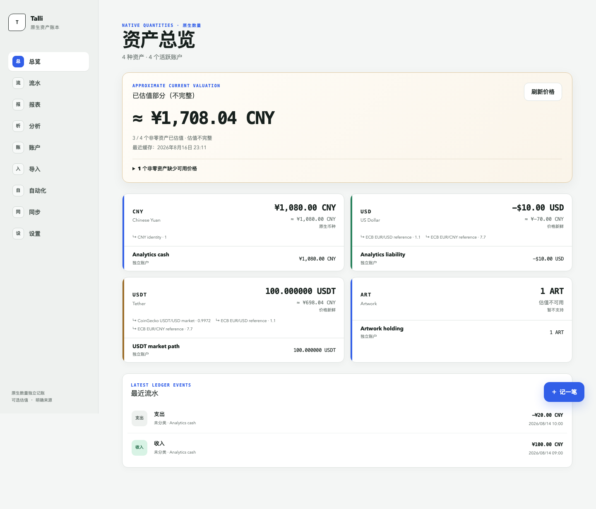

# Talli

[](https://github.com/wentAInx/Talli/actions/workflows/ci.yml)
[](LICENSE)

Talli is a single-user, self-hosted personal ledger for exact multi-asset
record keeping, read-only external observations, and historical net-worth
analytics.

> [!WARNING]
> **Talli currently has no built-in authentication.** Do not expose it directly
> to the Internet. Run it on a trusted private network or VPN, or place it
> behind an external authentication and access-control proxy.



## What is Talli?

Talli keeps native asset quantities as the accounting source of truth. Market
prices, imported statements, exchange observations, and on-chain activity live
in separate review or valuation layers. None of those sources can silently
rewrite the Ledger.

The current product release is `v6.0.0`. It is a Next.js application backed by
a local SQLite database and intended for one trusted operator.

## Key features

- Exact income, expense, transfer, exchange, fee, and reconciliation semantics
- Signed integer atomic units stored as SQLite `TEXT` and calculated with
  TypeScript `bigint`
- Self-hosted SQLite persistence with forward migrations and JSON backup/restore
- Current Home Asset valuation with explicit quote provenance and completeness
- Historical net worth, allocation, cash-flow, and period decomposition
- CSV, OFX/QFX, and ISO 20022 camt.053 statement import and review
- Deterministic import rules and recurring expectations
- Kraken Spot read-only observations
- Ethereum, Base, and Arbitrum public-address read-only observations
- Responsive desktop and mobile web interface

## Design principles

- Ledger quantities are the source of truth.
- Provider, statement, and on-chain data are not Ledger facts.
- Sync, preview, and file commit never write Ledger facts or balance snapshots;
  external evidence affects accounting state only through explicit Import or
  Reconcile actions.
- Rule projections remain suggestions until explicit Import. Generated
  recurring occurrences remain suggestions until explicit Link, Post, Import,
  or Skip persists the corresponding decision.
- Persisted Ledger quantities never use floating-point arithmetic or silent
  rounding.
- Missing prices make a valuation incomplete; they never become zero.
- Stablecoins follow explicit market quotes; Talli assumes no fiat peg.
- Provider HTTP runs server-side, on demand, and outside database write
  transactions.

See the [architecture documentation](docs/README.md) for the complete
invariants and implementation consequences.

## Quick start

Requirements:

- Node.js 22
- pnpm 10.11.0

```bash
pnpm install --frozen-lockfile
DATABASE_PATH=./data/finance.db pnpm db:setup
DATABASE_PATH=./data/finance.db pnpm dev
```

Open <http://localhost:3000>. Database setup runs checked migrations and an
idempotent reference-data seed; it does not create accounts, balances, or
transactions.

Do not point automated tests at a development or production database. The test
suites create isolated file-backed databases.

## Docker

```bash
docker compose up --build
```

Compose publishes port `3000` on host interfaces by default and stores SQLite
data in the `talli-data` named volume. Restrict the host firewall and network
exposure. Put the service behind a trusted private network, VPN, or external
authentication proxy before allowing remote access.

Before an upgrade, download and verify a JSON backup. For a raw volume snapshot,
stop application writes and copy the SQLite file together with any `-wal` and
`-shm` sidecars. Keep the previous image and pre-upgrade volume snapshot as a
rollback pair. Do not run multiple application replicas against the same SQLite
file.

## Configuration

Copy `.env.example` only as a template. Keep real values in the server runtime
environment and never commit them.

| Variable              | Purpose                                                                |
| --------------------- | ---------------------------------------------------------------------- |
| `DATABASE_PATH`       | Writable SQLite database path                                          |
| `PORT`                | Docker Compose host-published port; the container listens on `3000`    |
| `AUTO_SETUP_DATABASE` | Run migrations and idempotent seed at startup when set to `1`          |
| `COINGECKO_MODE`      | Fixed `demo`, `pro`, or explicit local `keyless` mode                  |
| `COINGECKO_API_KEY`   | Server-only CoinGecko Demo/Pro key                                     |
| `KRAKEN_API_KEY`      | Dedicated server-only Kraken Spot read-only key                        |
| `KRAKEN_API_SECRET`   | Dedicated server-only Kraken signing secret                            |
| `ALCHEMY_API_KEY`     | Server-only key for fixed Ethereum/Base/Arbitrum read-only RPC origins |

Talli does not store provider credentials in SQLite or backup JSON. It does not
fall back between CoinGecko modes after an authentication failure.

## Supported integrations

- **CoinGecko:** current and historical crypto/USD market observations
- **European Central Bank:** fiat reference-rate observations
- **Kraken Spot:** balances and ledger/trade observations using a dedicated key
  limited to `query-funds`, `query-ledger`, and `query-closed-trades`
- **Alchemy:** public-address observations for Ethereum Mainnet, Base Mainnet,
  and Arbitrum One through a fixed read-method allowlist
- **Financial files:** CSV, OFX 1, OFX 2/QFX, and supported camt.053 subsets

Never provide Talli with a wallet private key, mnemonic, seed phrase, or a
write-capable exchange credential. Talli does not sign or broadcast
transactions.

## Data ownership and privacy

Talli's persisted Ledger and supported application records stay in the SQLite
file you operate. Backups preserve the versioned portable Ledger,
configuration, external/import evidence, automation, and recurring-data
contract, while credentials and derived provider caches are excluded. Raw
imported bank files and full statement account numbers are not persisted.

Enabled integrations necessarily make server-side requests: Kraken receives
authenticated read-only requests, Alchemy receives requests involving public
wallet addresses, and CoinGecko/ECB receive asset or rate queries. Review their
privacy policies before enabling them.

Treat the database, backups, statement files, screenshots, and logs as private
financial data. See [SECURITY.md](SECURITY.md) before reporting a problem.

## Documentation

- [Documentation index](docs/README.md)
- [Ledger and money invariants](docs/architecture/ledger-and-money.md)
- [Current valuation](docs/architecture/valuation.md)
- [Historical analytics](docs/architecture/historical-analytics.md)
- [External sync and import boundaries](docs/architecture/external-sync.md)
- [Backup and migrations](docs/architecture/backup-and-migrations.md)
- [Historical design material](docs/history/README.md)
- [Roadmap and non-goals](ROADMAP.md)
- [Release history](CHANGELOG.md)

## Development

Run the full local validation gate before opening a pull request:

```bash
pnpm format:check
pnpm lint
pnpm typecheck
pnpm db:check
pnpm test:unit
pnpm test:integration
pnpm build
pnpm security:check
pnpm test:e2e
docker compose config
```

Financial-core changes require deterministic tests for exact quantities,
snapshot boundaries, transaction atomicity, migration compatibility, and any
affected backup behavior. See [CONTRIBUTING.md](CONTRIBUTING.md).

## Contributing

Read [CONTRIBUTING.md](CONTRIBUTING.md), [AGENTS.md](AGENTS.md), and the current
architecture documents before proposing a change. Never use real credentials
or financial records in an issue, fixture, screenshot, or pull request.

## License

Licensed under the [Apache License 2.0](LICENSE).
